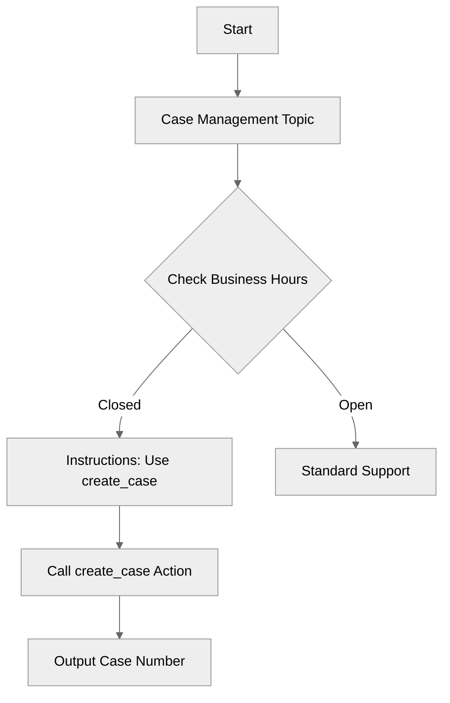

# InstructionActionReferences

## Overview

Learn how to **reference actions directly** within your reasoning instructions. This technique helps guide the LLM to use specific actions in specific contexts and allows embedding dynamic variable values in the same prompt.

## Agent Flow



## Key Concepts

- **Action References**: `{!@actions.action_name}` inserts a reference to the action definition.
- **Dynamic Context**: You can mix action references with variable expressions `{!@variables.name}`.

## How It Works

### The Instruction Pattern

By referencing `{!@actions.create_case}`, you explicitly signal to the model that this specific tool is relevant for this specific instruction.

## Key Code Snippets

### Embedded Action Reference

```agentscript
instructions:->
   | If not within business hours, create a support case by using {!@actions.create_case}.
     Share the Case Number and when to expect follow-up ({!@variables.next_open_time}).
```

## Try It Out

### Example Interaction

```text
Agent: Hi! I can help you create support cases.

User: I need help with my login, but it's late.

Agent: I've created a support case for you. Your Case Number is 12345. You can expect a follow-up by 9:00 AM Tomorrow.
```

## What's Next

- **PromptTemplateActions**: Use Salesforce Prompt Templates for more complex generation.
- **AdvancedReasoningPatterns**: Explore deeper reasoning techniques.
