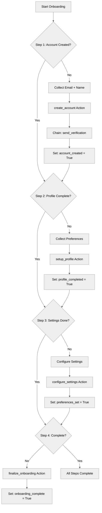

# MultiStepWorkflows Agent

## Overview

This recipe demonstrates how to orchestrate **multi-step workflows** where actions are chained together in sequence. Learn how to build onboarding processes with multiple steps, pass data between actions, and track progress.

## Agent Flow



## Key Concepts

- **Action chaining**: Using `run` to execute follow-up actions
- **Step-by-step workflows**: Guided multi-step processes
- **Progress tracking**: Boolean flags for each step
- **Data flow**: Outputs from one step feed into next
- **Procedural instructions**: Guide the LLM through steps

## How It Works

### Workflow State Variables

Track progress with boolean flags:

```agentscript
variables:
   customer_email: mutable string = ""
   customer_id: mutable string = ""
   account_created: mutable boolean = False
   profile_completed: mutable boolean = False
   preferences_set: mutable boolean = False
   onboarding_complete: mutable boolean = False
   verification_token: mutable string = ""
   step: mutable number = 0
```

### Step-by-Step Instructions

Use procedural instructions to guide the workflow:

```agentscript
reasoning:
   instructions: ->
      | Follow the below Rules step by step
        Rules:
        Step 1:
           First step is to create Account with the name and customer email
           If not provided you will ask for it and you won't proceed.
           After Step 1 please proceed to Step 2
        Step 2:
           Before setting up the customer's profile,
           Ask the customer about their preferences:
              1. Notification preferences (email, SMS, or both)
              2. Preferred language
              3. Timezone
           Collect all this info and call it 'preferences'.
        Only proceed with setup_profile action after you have preferences.
        After Step 2 please proceed to Step 3
        Step 3:
           Before configuring account settings, ask the customer about:
              1. Default notification settings
              2. Privacy preferences
           Collect all this info and call it 'settings'.
        Only proceed with configure_settings action after you have settings.
        After Step 3 please proceed to Step 4
        Step 4:
           This is the final action.
           Execute finalize_onboarding
           Tell customer they have completed onboarding successfully
```

### Action with Chained Follow-up

```agentscript
actions:
   create_account: @actions.create_account
      with email = ...
      with name = ...
      set @variables.customer_id = @outputs.customer_id
      set @variables.account_created = @outputs.success
      set @variables.customer_email = @outputs.customer_email
      # Chain a follow-up action
      run @actions.send_verification
         with customer_id = @variables.customer_id
         with email = @variables.customer_email
         set @variables.verification_token = @outputs.token
```

## Key Code Snippets

### Complete Action Definitions

```agentscript
actions:
   create_account:
      description: "Creates a new customer account"
      inputs:
         email: string
            description: "Customer's email address"
         name: string
            description: "Customer's full name"
      outputs:
         customer_id: string
            description: "Unique identifier for the new account"
         success: boolean
            description: "Whether account was created"
         customer_email: string
            description: "Customer email"
      target: "flow://CreateCustomerAccount"

   send_verification:
      description: "Sends email verification"
      inputs:
         customer_id: string
            description: "Customer to send verification to"
         email: string
            description: "Email address for verification"
      outputs:
         token: string
            description: "Verification token"
         sent: boolean
            description: "Whether email was sent"
      target: "flow://SendVerificationEmail"

   setup_profile:
      description: "Creates customer profile with preferences"
      inputs:
         customer_id: string
            description: "Customer to set up profile for"
         preferences: string
            description: "Customer preferences"
      outputs:
         profile_id: string
            description: "Profile identifier"
         success: boolean
            description: "Whether profile was created"
      target: "flow://SetupCustomerProfile"

   configure_settings:
      description: "Sets default account settings"
      inputs:
         customer_id: string
            description: "Customer to configure"
         settings: string
            description: "Account settings"
      outputs:
         success: boolean
            description: "Whether settings were configured"
      target: "flow://ConfigureAccountSettings"

   finalize_onboarding:
      description: "Marks onboarding as complete and sends welcome email"
      inputs:
         customer_id: string
            description: "Customer to finalize"
      outputs:
         success: boolean
            description: "Whether onboarding was finalized"
         welcome_sent: boolean
            description: "Whether welcome email was sent"
      target: "flow://FinalizeOnboarding"
```

### Reasoning Actions

```agentscript
actions:
   create_account: @actions.create_account
      with email = ...
      with name = ...
      set @variables.customer_id = @outputs.customer_id
      set @variables.account_created = @outputs.success
      set @variables.customer_email = @outputs.customer_email
      run @actions.send_verification
         with customer_id = @variables.customer_id
         with email = @variables.customer_email
         set @variables.verification_token = @outputs.token

   setup_profile: @actions.setup_profile
      with customer_id = ...
      with preferences = ...
      set @variables.profile_completed = @outputs.success

   configure_settings: @actions.configure_settings
      with customer_id = ...
      with settings = ...
      set @variables.preferences_set = @outputs.success

   finalize_onboarding: @actions.finalize_onboarding
      with customer_id = ...
      set @variables.onboarding_complete = @outputs.success
```

## Try It Out

### Step 1: Account Creation

```text
Agent: Welcome! Let's get you set up. Please provide your email and name.

User: john@example.com, John Smith

[Agent calls create_account]
  → create_account(email="john@example.com", name="John Smith")
  → Returns: customer_id="CUST-789"
  → Chains: send_verification(customer_id="CUST-789", email="...")
  → Returns: token="VERIFY-ABC"

Agent: Great! I've created your account and sent a verification email.

       Progress: Step 1 of 4 complete ✓
       Next: Let's set up your profile.
```

### Step 2: Profile Setup

```text
Agent: What are your preferences for:
       1. Notifications (email, SMS, or both)?
       2. Preferred language?
       3. Timezone?

User: Email only, English, Pacific Time

[Agent calls setup_profile]
  → setup_profile(customer_id="CUST-789", preferences="...")

Agent: Profile configured!

       Progress: Step 2 of 4 complete ✓
       Next: Configure your account settings.
```

### Step 3: Settings

```text
Agent: What are your preferences for:
       1. Default notification settings?
       2. Privacy preferences?

User: All notifications on, standard privacy

[Agent calls configure_settings]

Agent: Settings saved!

       Progress: Step 3 of 4 complete ✓
       Next: Finalizing your account...
```

### Step 4: Completion

```text
[Agent calls finalize_onboarding]

Agent: ✓ Onboarding complete!

       Your account is fully set up.
       Customer ID: CUST-789
       A welcome email has been sent.
```

## Workflow Patterns

### Linear Workflow

Steps in fixed order:

```text
Step 1 → Step 2 → Step 3 → Complete
```

### Action Chaining with `run`

Execute follow-up after primary action:

```agentscript
primary: @actions.primary_action
   with input=...
   set @variables.result = @outputs.value
   run @actions.follow_up
      with data=@variables.result
```

**Note**: Only one level of nesting allowed.

## Best Practices

### Track State Clearly

```agentscript
variables:
   account_created: mutable boolean = False
   profile_completed: mutable boolean = False
```

Use descriptive boolean flags.

### Provide Progress Feedback

```text
Progress: Step 2 of 4 complete ✓
Next: Configure your account settings.
```

### Validate Before Each Step

The instructions guide the LLM to collect all needed info before calling actions.

### Handle Partial Completion

Allow users to resume where they left off.

## What's Next

- **ActionCallbacks**: More on the `run` keyword
- **MultiTopicOrchestration**: Split workflows across topics
- **ErrorHandling**: Handle step failures

## Testing

### Test Case 1: Complete Happy Path

- Execute all 4 steps
- Verify state updates at each
- Confirm final completion

### Test Case 2: Resume from Step 2

- Set account_created=True, customer_id="..."
- Start conversation
- Should continue at step 2

### Test Case 3: Data Flow

- Verify customer_id from step 1 used in steps 2-4
- Check all state persists
